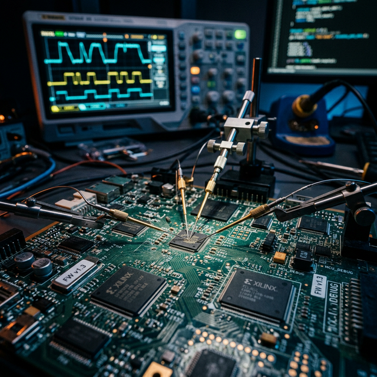
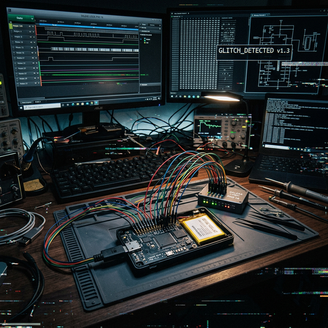

# PHYSICAL LAB

We are a collective of researchers, engineers, and hackers dedicated to the art of hardware reverse engineering.
In an increasingly connected world, the physical layer remains the final frontier of security.

Our mission is to dissect, analyze, and understand the secure enclaves that protect the world's most critical data.
From side-channel analysis to fault injection, we employ cutting-edge techniques to uncover vulnerabilities that software boundaries cannot hide.

## Projects

Our ongoing and past operations uncovering the physical truth.

### Operation: SILICON GHOST
*Type: Protocol Analysis & Firmware Extraction*

A deep dive into the proprietary wireless protocol used by a widely deployed industrial control system. By intercepting RF communications and reverse engineering the baseband processor firmware extracted via JTAG, we uncovered critical authentication bypass vulnerabilities.

### Project: COLD FORGE
*Type: Hardware Wallet Assessment*

Comprehensive physical security assessment of a popular next-generation cryptocurrency hardware wallet. Utilizing voltage glitching during the bootloader verification phase, we demonstrated a novel method for bypassing firmware signing checks.
