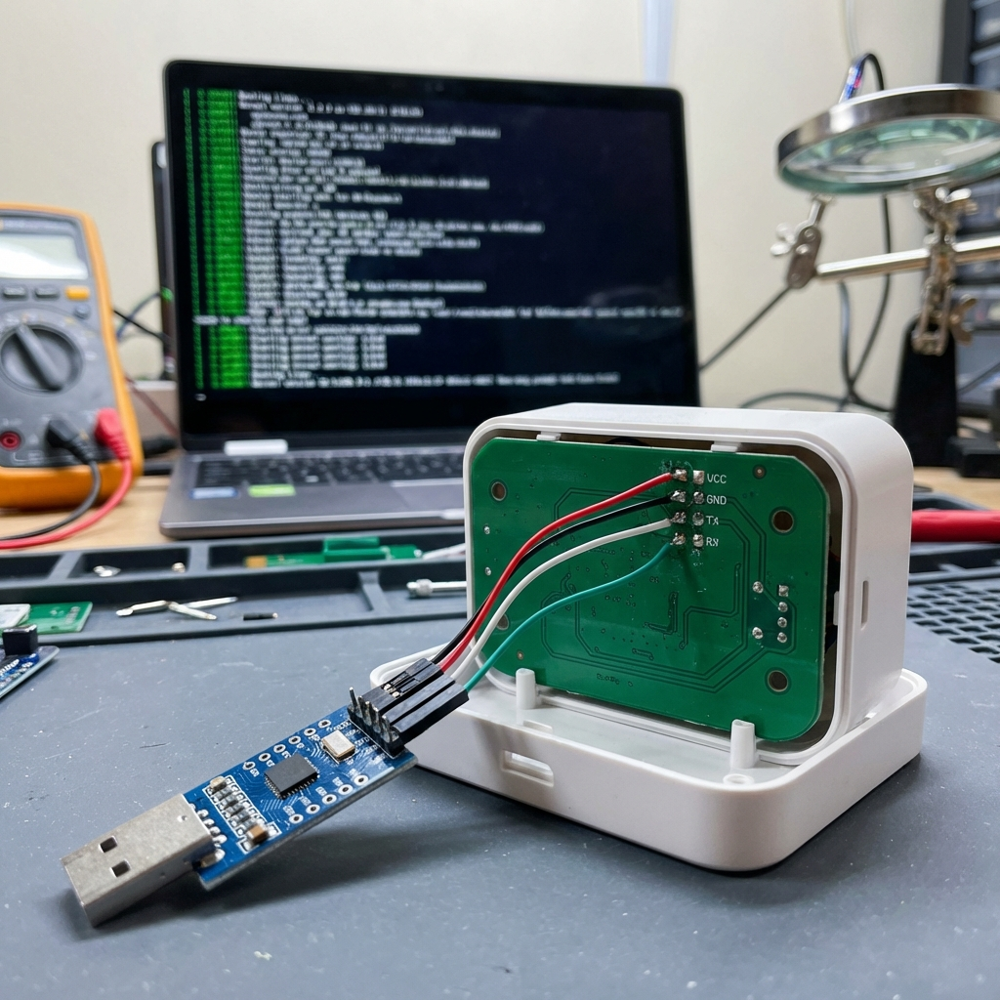

# Analyzing UART Boot Logs for Security Research

## Overview

UART (Universal Asynchronous Receiver-Transmitter) is often the first serial interface a hardware hacker targets when examining a new device. During boot, most embedded systems output verbose diagnostic information over UART — including kernel versions, mount points, running services, and sometimes even plaintext credentials.

This post demonstrates how we tapped into the UART output of a consumer IoT gateway and extracted critical security information from its boot sequence.

## Locating the UART Pins

On our target device — a popular home automation hub — we began by disassembling the enclosure and examining the main PCB. Near the processor, we identified four pads in a row that matched the typical UART layout: VCC, TX, RX, and GND.

Using an oscilloscope, we probed each pad during power-on. The TX pin showed characteristic voltage transitions as the processor began outputting serial data. We measured the signal timing to determine the baud rate: 115200, the most common setting for embedded Linux devices.



## Capturing Boot Output

We connected a USB-to-UART adapter (CP2102-based) to the TX and GND pins, then used `minicom` on our analysis workstation:

```bash
minicom -D /dev/ttyUSB0 -b 115200
```

The moment we powered on the device, a flood of boot messages appeared. The U-Boot bootloader printed hardware initialization details, followed by the Linux kernel decompressing and mounting the root filesystem.

## Interesting Findings

Several pieces of valuable intelligence were revealed in the boot logs:

1. **Kernel Version**: `Linux 4.14.180` — a version with multiple known CVEs
2. **Root Filesystem**: Mounted as `squashfs` on `/dev/mtdblock5`, indicating a read-only compressed filesystem
3. **Debug Shell**: The boot arguments included `console=ttyS0,115200 init=/bin/sh`, suggesting a debug configuration was left enabled
4. **WiFi Credentials**: The WPA supplicant configuration was echoed during the network initialization phase
5. **Telnet Daemon**: A telnet server was started on port 2323 with hardcoded credentials visible in the startup script

## Extracting the Firmware

With knowledge of the MTD partition layout from the boot logs, we could map out the entire flash memory:

| Partition  | Device       | Size   | Contents          |
|-----------|-------------|--------|-------------------|
| bootloader | /dev/mtd0   | 256KB  | U-Boot            |
| kernel     | /dev/mtd3   | 4MB    | Linux kernel      |
| rootfs     | /dev/mtd5   | 12MB   | Root filesystem   |
| config     | /dev/mtd7   | 1MB    | User configuration|

This information proved invaluable for the next phase of our research — dumping and analyzing the firmware offline.

## Defense Recommendations

For manufacturers looking to secure their devices:

- Disable or remove UART access points on production boards
- Suppress verbose boot logging in release firmware
- Never include credentials in boot scripts or init sequences
- Use secure boot to prevent unauthorized firmware modification

## Conclusion

UART boot log analysis remains one of the simplest yet most effective techniques in the hardware security researcher's toolkit. A few minutes with a $3 USB adapter can reveal the entire architecture and security posture of a device. Manufacturers continue to underestimate the risk of leaving serial interfaces accessible, making this technique consistently productive in security assessments.
